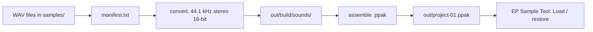

# ep_sampler

ep_sampler builds a list of sample WAV files into a single `.ppak` backup file
that the official Teenage Engineering **EP Sample Tool** can restore onto an
**EP-133 K.O. II** (and, via `device_sku`, the EP-1320 / EP-40). Point it at a
folder of samples, describe where they go in `manifest.txt`, and it produces
the exact file you would otherwise get from the tool's "Backup" button — only
built from *your* samples. It also generates `config.json` effect presets for
the **EP-2350 Ting** FX microphone — including a randomizer to go wild with the
four FX buttons.

## Pipeline



## Requirements

- Python 3.10+ (standard library only)
- `ffmpeg` (or `sox`) for audio conversion

```bash
ffmpeg -version
```

## Quick start

```bash
# 1. put WAVs in samples/ and list them in manifest.txt, then:
python -m ep_sampler build

# or install once and use the console script:
pip install -e .
ep-sampler build
```

The result is `out/project-01.ppak`. In the EP Sample Tool use **Load** /
**Upload** and point it at that file.

## Interactive menu

Run `ep-sampler` with no arguments and it walks you through two questions:

```text
$ ep-sampler

Which EP device should we build a backup for?
  [1] EP-40 Riddim (default)
  [2] EP-133
  [3] EP-1320
  [4] EP-2350 Ting
> 

What do you want to build?
  [1] My manifest (manifest.txt) (default)
  [2] Factory sample folders
>
```

- The device defaults to the **EP-40 Riddim** (press Enter).
- "My manifest" builds `manifest.txt` for the chosen device.
- "Factory sample folders" builds the chosen device's factory set — the EP-40
  has no bundled factory set, so picking it re-asks for EP-133 or EP-1320.
- Picking **EP-2350 Ting** skips straight to its FX-config builder and asks
  whether to randomise the presets.

The same flows run **non-interactively** via the subcommands below, so they can
be scripted (startup arguments instead of a menu).

## Commands

| Command | What it does |
| --- | --- |
| `ep-sampler build` | Convert every sample and build the `.ppak`. |
| `ep-sampler build-factory ep133` | Build a `.ppak` from the EP-133 factory sample set. |
| `ep-sampler ting` | Build an EP-2350 Ting `config.json` (FX mic). |
| `ep-sampler add samples/kick.wav` | Append one sample to `manifest.txt` (auto slot/pad/name). |
| `ep-sampler inspect out/project-01.ppak` | List a built `.ppak`'s metadata, sounds and pad bindings. |

```bash
# add with explicit placement
ep-sampler add samples/snare.wav --slot 102 --group B --pad 4 --bpm 134 --time-mode bpm

# build with overrides (or edit config.json)
ep-sampler build --project 2 --mode scratch --out-dir out
```

## Factory backups

`build-factory` rebuilds the device's **factory sound set** from your own
copies of the samples. It knows the factory slot for every sample on the
EP-133 (308 samples) and the EP-1320 (220 samples), and writes each into its
original slot with the correct device identity in `meta.json`.

```bash
ep-sampler build-factory ep133
ep-sampler build-factory ep1320
```

It looks for each factory sample **by name** (case-insensitive, ignoring
spaces/punctuation) anywhere under the configured folders — including
sub-folders — so a sample named `BATTLE KIK` matches
`some/where/battle_kik.wav`. Search order:

1. the device's own folder (`ep133_samples_dir` / `ep1320_samples_dir`)
2. the main folder (`samples_dir`)

Every sample that can't be found is listed, and the build continues with the
rest. Pass `--strict` to abort instead when anything is missing:

```bash
ep-sampler build-factory ep1320 --strict
```

Factory builds use a **blank project** — they restore the sample library into
the factory slots but do not reproduce the factory demo patterns (those are
sequencer data, not part of the known `.ppak` sound format).

## Ting (EP-2350 FX mic)

The Ting is a standalone handheld FX microphone, not a sampler. It mounts a
tiny disk and reads a single `config.json` that defines the four FX buttons
(ECHO, SPRING, PIXIE, ROBOT) as effect chains with optional handle / shake /
lfo / trigger modulation, plus up to four sample triggers.

```bash
ep-sampler ting                       # factory-style presets (ECHO/SPRING/PIXIE/ROBOT)
ep-sampler ting --randomize           # random FX chains and parameters
ep-sampler ting --randomize --seed 7  # reproducible randomisation
ep-sampler ting --samples             # include a samples section (1.wav..4.wav)
```

The randomizer picks effects from all ten documented effects (`BALANCE`,
`DELAY`, `DIST`, `HARMONY`, `LOWPASS`, `HIGHPASS`, `SAMPLE`, `REVERB`, `RING`,
`SSB`), randomises each parameter inside its documented range, and wires up
random `handle` / `shake` / `lfo` / `trigger` modulation — "go crazy". Output
goes to `out/ting/config.json` (override with `--out`); copy it onto the
`tingdisk` volume and restart the mic.

## Manifest format

One sample per line, columns separated by **TAB** (`#` starts a comment):

```
slot  group  pad  bpm  time_mode  playmode  name  file
```

| Column | Meaning |
| --- | --- |
| `slot` | Sample slot `1..999`. Each must be unique. |
| `group` | Pad group `A`, `B`, `C` or `D`. |
| `pad` | Pad `1..12` (TAR `pNN` convention, bottom-up — table below). |
| `bpm` | Optional tempo for time-stretch (`-` or blank = leave the 120.0 default). |
| `time_mode` | `off`, `bar` or `bpm`. |
| `playmode` | `oneshot`, `key` or `legato`. |
| `name` | Display name, ≤20 chars, no spaces (becomes `<slot> <name>.wav`). |
| `file` | Path to the WAV, relative to `samples_dir` (or absolute). |

Pad numbering (bottom-up, matching the `pads/<group>/pNN` files inside the TAR):

| pad | label | pad | label | pad | label | pad | label |
| --- | --- | --- | --- | --- | --- | --- | --- |
| 1 | `.` | 4 | `1` | 7 | `4` | 10 | `7` |
| 2 | `0` | 5 | `2` | 8 | `5` | 11 | `8` |
| 3 | `ENT` | 6 | `3` | 9 | `6` | 12 | `9` |

Example `manifest.txt`:

```
100	A	10	120	off	oneshot	Kick	kick.wav
101	A	11	134	bpm	oneshot	Snare	snare.wav
```

## Configuration

Defaults live in `config.json` (all keys optional — missing keys fall back to
built-in defaults). Every key can also be overridden on the command line.

| Key | Meaning |
| --- | --- |
| `samples_dir` | Main folder of input sample WAVs. |
| `ep133_samples_dir` | Folder holding the EP-133 default/factory samples. |
| `ep1320_samples_dir` | Folder holding the EP-1320 default/factory samples. |
| `manifest_file` | The sample list. |
| `out_dir` | Where the `.ppak` and intermediate files go. |
| `project` | Which project (1..99) the backup carries. |
| `mode` | `scratch` (build from the format) or `base` (patch a real backup). |
| `base_pak` | A real Sample Tool backup, used when `mode = "base"`. |
| `device_sku` / `base_sku` | `TE032AS001` for K.O. II / riddim. |
| `device_version` | Your device's OS version (shown in Sample Tool). |
| `audio_tool` | `ffmpeg` or `sox`. |
| `ffmpeg_extra_args` | Extra converter args, e.g. `["-af", "loudnorm"]`. |

## The .ppak format

A `.ppak` is a ZIP archive with three kinds of entry (all with a leading `/`):

```
/projects/P01.tar          one TAR holding a 26-byte binary record per pad
/sounds/100 Kick.wav       one 44.1 kHz stereo 16-bit PCM WAV per sample slot
/meta.json                 pak metadata (device SKU, version, timestamp, ...)
```

Details that matter (all verified by community reverse-engineering; see
"Notes" below):

- **Audio**: 44.1 kHz, stereo, 16-bit PCM. The device transcodes to
  46875 Hz mono internally on upload; a `.ppak` holding the internal
  transcoded format is silently rejected, so the converter always targets
  44.1 kHz stereo.
- **Pad records**: 26 bytes per pad (`ep_sampler/pad_record.py`). The build
  writes the sample slot, sample length in frames, BPM, time-stretch mode and
  play mode at the documented offsets; unassigned pads keep the factory blank
  record.
- **No `settings` file**: adding one to the project TAR makes Sample Tool fail
  with `ERROR CLOCK 43`. This builder never adds it.

## Build modes

- **`scratch`** (default) builds the archive entirely from the documented
  format. It is fully self-contained, but the Sample Tool parser is strict
  about details that are hard to reproduce exactly, so **verify the result on
  your device** before relying on it.
- **`base`** starts from a real `.ppak` you export once from the EP Sample
  Tool, patches only the bytes that need to change (pad records, `meta.json`
  timestamp, the `/sounds/` WAVs), and re-zips. This is the most
  compatibility-safe path. Set `"mode": "base"` and
  `"base_pak": "/path/to/backup.ppak"` in `config.json`.

Either way, check free space on the device first — a restore that does not fit
fails with `ERR SYSTEM_MODEL`.

## Notes

- Format knowledge comes from the community reverse-engineering in
  [`ZacharySBrown/ep133-ppak`](https://github.com/ZacharySBrown/ep133-ppak)
  (its `PROTOCOL.md` is the reference spec), building on `phones24`'s archive
  parser, `ep133-krate`, and `garrettjwilke`'s SysEx work. This project is not
  affiliated with Teenage Engineering.
- `meta.json` gets a fresh millisecond-precision `generated_at` on every build;
  Sample Tool refuses stale or stub timestamps.
- Two pad-numbering conventions exist on the device (top-down SysEx vs
  bottom-up TAR). This project uses the **TAR** convention throughout the
  manifest and files; the mapping table above is the safe reference.
- The factory sample name/slot lists (`ep_sampler/data/*.txt`) are name lists
  only — no audio is bundled. They come from community documentation:
  [`codejunkee1/ep133-sounds`](https://github.com/codejunkee1/ep133-sounds)
  for the EP-133 and [`jpopesculian/ep1320`](https://github.com/jpopesculian/ep1320)
  for the EP-1320.

## Creating a GitHub repo

```bash
cd ep_sampler
git init -b main
git add .
git commit -m "Initial commit: EP-133 .ppak builder"

# with the gh CLI:
gh repo create ep_sampler --public --source=. --push

# or manually: create an empty repo on github.com, then
git remote add origin git@github.com:<you>/ep_sampler.git
git push -u origin main
```

## License

MIT. Provided as-is; restoring a malformed `.ppak` can wipe or corrupt the
device's sample memory, so always keep a real Sample Tool backup first.
